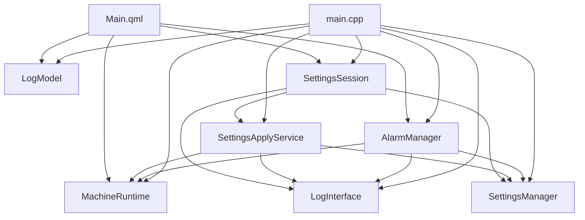

# DevicePilotHMI

DevicePilotHMI is a Qt Quick / QML desktop HMI demo for a simulated machine. It is designed as a small but structured project that keeps application state in C++ and uses QML mainly for presentation and interaction.

The project focuses on:

- a simulated runtime state machine
- threshold-based alarm handling
- an event log with filtering and acknowledgment
- editable, validated, and persisted settings
- a cleaner C++/QML integration boundary than a typical all-in-QML demo

## Highlights

- Dashboard page with live machine telemetry, machine state, alarm banner, and control actions
- Event log page with level filter, text search, and "only unacknowledged" filtering
- Settings page with draft editing, validation, apply/revert/defaults flow, and JSON persistence
- Runtime-aware settings policy:
  - all changes are allowed while the machine is idle
  - threshold changes are allowed while running
  - update interval changes are blocked while running
  - settings are blocked during starting, stopping, and fault states
- Settings are automatically loaded from disk, validated, and repaired to defaults if the file is missing or invalid

## Tech Stack

- C++20
- Qt 6 Quick
- Qt 6 QML
- CMake

The current `CMakeLists.txt` requires Qt 6.11 or newer.

## Application Overview

The app is split into three top-level pages:

- `Dashboard`
  - shows temperature, pressure, speed, machine status, and alarm state
  - allows `Start`, `Stop`, and `Reset Fault`
- `Event Log`
  - shows runtime, config, warning, and fault events
  - supports filtering and acknowledgment
- `Settings`
  - edits warning/fault thresholds and update interval
  - validates input before applying
  - persists committed settings to a JSON file

## Runtime Behavior

The machine starts in `Idle`.

- `Start`
  - transitions to `Starting`
  - after 5 seconds enters `Running`
- `Running`
  - temperature, pressure, and speed increase over time
  - alarm rules are evaluated continuously
- `Stop`
  - transitions to `Stopping`
  - after 1.2 seconds returns to `Idle`
- `Fault`
  - entered when temperature or pressure reaches a fault threshold
  - runtime timers stop
  - `Reset Fault` restores the machine to idle values

## Alarm Model

`AlarmManager` owns the alarm state exposed to the dashboard.

- `Normal`
  - banner text: `System normal`
- `Warning`
  - raised when warning thresholds are exceeded
- `Fault`
  - raised when fault thresholds are exceeded
  - forces the runtime into fault state

Current alarm evaluation is threshold-based and uses the current committed settings snapshot.

## Settings Model

The settings flow is intentionally split into separate responsibilities:

- `SettingsManager`
  - owns the committed settings snapshot
  - loads and persists settings
  - emits change signals for threshold changes and update interval changes
- `SettingsDraft`
  - owns editable form state used by the settings page
  - tracks validation and dirty state
- `SettingsApplyService`
  - decides whether a draft can be applied in the current runtime state
- `SettingsSession`
  - is the QML-facing page session object
  - exposes the draft and apply-related UI state

Validation rules include:

- temperature thresholds must be within valid numeric ranges
- pressure thresholds must be within valid numeric ranges
- update interval must be between `100` and `5000` ms
- warning thresholds must stay lower than their matching fault thresholds

## Persistence

Settings are stored as JSON in the platform application config directory.

On Windows, the file is typically written to a path like:

```text
C:\Users\<User>\AppData\Local\DevicePilotHMI\devicepilothmi_settings.json
```

Behavior on startup:

- if the file does not exist, defaults are used
- if the file exists but is malformed or invalid, defaults are restored
- repaired settings are written back to disk

## Architecture

At startup, `main.cpp` creates the long-lived application objects and injects them into the root QML object:

- `LogModel`
- `LogInterface`
- `SettingsManager`
- `MachineRuntime`
- `AlarmManager`
- `SettingsApplyService`
- `SettingsSession`

The intended layering is:



The project deliberately avoids using a single "god controller" as the only QML entry point.

## Project Structure

```text
DevicePilotHMI/
├── CMakeLists.txt
├── qml/
│   ├── Main.qml
│   ├── components/
│   │   ├── ControlPanel.qml
│   │   ├── MetricCard.qml
│   │   └── StatusBanner.qml
│   └── pages/
│       ├── DashboardPage.qml
│       ├── LogPage.qml
│       └── SettingsPage.qml
└── src/
    ├── alarm/
    │   ├── alarm_manager.h/.cpp
    ├── log/
    │   ├── log_interface.h/.cpp
    │   ├── log_model.h/.cpp
    │   └── log_filter_proxy_model.h/.cpp
    ├── runtime/
    │   └── machine_runtime.h/.cpp
    └── settings/
        ├── settings_apply_service.h/.cpp
        ├── settings_defined.h
        ├── settings_draft.h/.cpp
        ├── settings_file_store.h/.cpp
        ├── settings_json_codec.h/.cpp
        ├── settings_manager.h/.cpp
        ├── settings_session.h/.cpp
        └── settings_validation.h/.cpp
```

## Build

### Requirements

- CMake 3.16 or newer
- Qt 6.11 or newer with:
  - `Qt6::Quick`
  - `Qt6::Qml`
- a C++20-capable compiler

### Qt Creator

Open the project in Qt Creator, select a Qt 6 kit, and build normally.

### Command Line

Example with a local Qt installation on Windows:

```powershell
cmake -S . -B build -G Ninja -DCMAKE_PREFIX_PATH="C:\Qt\6.11.0\mingw_64"
cmake --build build
```

If you use another generator or compiler, adjust the `CMAKE_PREFIX_PATH` and generator accordingly.

## Run

After building, launch the generated `DevicePilotHMI` executable.

Typical usage flow:

1. Start the machine from the dashboard.
2. Watch telemetry rise in the running state.
3. Observe warning or fault transitions when thresholds are crossed.
4. Open the event log to inspect runtime and config activity.
5. Open settings to edit thresholds or update interval.
6. Apply or revert the draft and confirm persistence across restarts.

## Current Limitations

- The runtime is simulated; there is no real device backend yet.
- Alarm handling is still simple and does not implement a full industrial alarm lifecycle such as acknowledge/latched/cleared state modeling.
- There is no automated test suite yet.
- The project is currently organized as a single application target rather than a split core library plus app shell.

## Development Notes

This codebase is most useful as:

- a Qt/QML architecture practice project
- a small HMI portfolio piece
- a base for further refactoring toward real-device integration, stronger alarm modeling, and automated tests

## License

No license has been added yet. If you plan to publish the repository, add an explicit license file.
